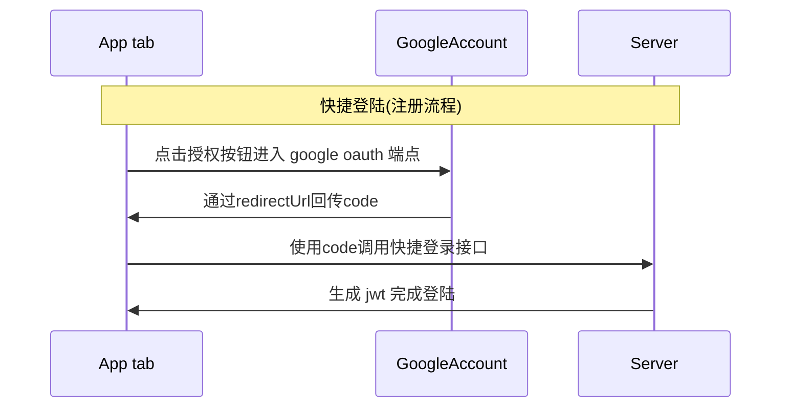

```mermaid
sequenceDiagram
    participant F as App tab
    participant G as GoogleAccount
    participant B as Server
    Note over F,B: 快捷登陆(注册流程)
    F->>G: 点击授权按钮进入 google oauth 端点
    G->>F: 通过redirectUrl回传code
    F->>B: 使用code调用快捷登录接口
    B->>F: 生成 jwt 完成登陆
```