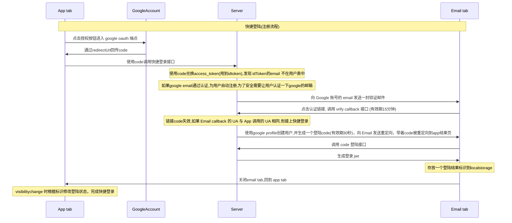

```mermaid
sequenceDiagram
    participant F as App tab
    participant G as GoogleAccount
    participant B as Server
    participant E as Email tab
    Note over F,E: 快捷登陆(注册流程)
    F->>G: 点击授权按钮进入 google oauth 端点
    G->>F: 通过redirectUrl回传code
    F->>B: 使用code调用快捷登录接口
    Note over B: 使用code兑换access_token(用到idtoken),发现 idToken的email 不在用户表中
    Note over B: 如果google email通过认证,为用户自动注册,为了安全需要让用户认证一下google的邮箱
    B->>E: 向 Google 账号的 email 发送一封验证邮件
    E->>B: 点击认证链接, 调用 vrify callback 接口 (有效期15分钟)
    Note over B: 链接code失效,如果 Email callback 的 UA 与 App 调用的 UA 相同,衔接上快捷登录
    B->>E: 使用google profile创建用户,并生成一个登陆code(有效期30秒)，向 Email 发送重定向，带着code被重定向到app结果页 
    E->>B: 调用 code 登陆接口
    B->>E: 生成登录 jwt
    Note over E: 存放一个登陆结果标识到localstorage
    E->>F: 关闭email tab,回到 app tab
    Note over F: visibilitychange 时根据标识修改登陆状态，完成快捷登录

```